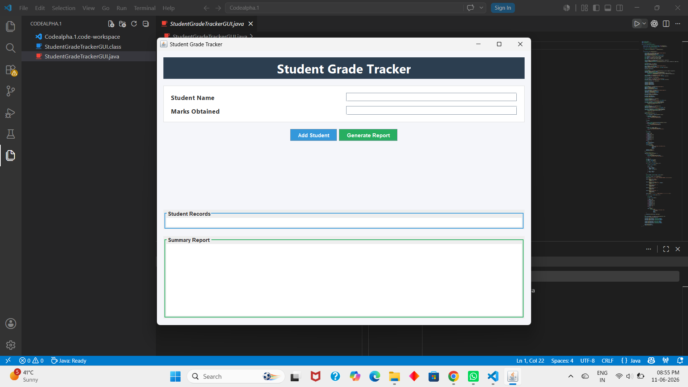
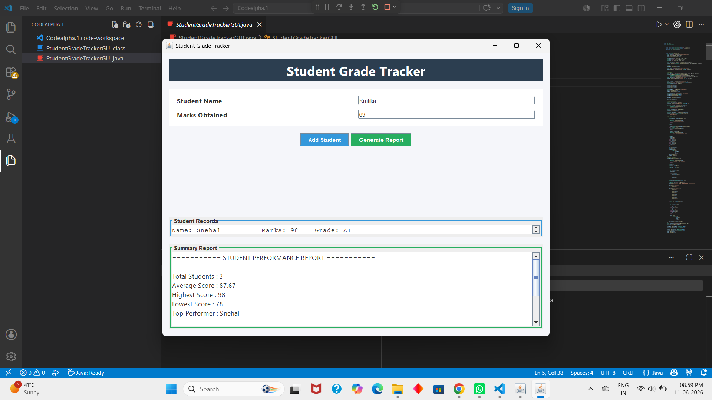

# CodeAlpha_StudentGradeTrackerGUI
Java Swing application for managing student grades and generating performance reports.

*Student Grade Tracker GUI* 

 *#Description* 
 
Student Grade Tracker GUI is a Java-based desktop application developed using Swing. It allows users to enter student names and marks, calculate average marks, find the highest and lowest scores, and display a performance summary through a simple graphical user interface.

 *# Features* 
- Add student names and marks
- Calculate average marks
- Display highest marks
- Display lowest marks
- User-friendly GUI using Java Swing

 *# Technologies Used* 
- Java
- Swing (GUI)

 *# How to Run* 
1. Open the project in VS Code or any Java IDE.
2. Compile the program:
   javac StudentGradeTrackerGUI.java
3. Run the program:
   java StudentGradeTrackerGUI

# Screenshots
1.Main Window

2.Result Window

 

  
       
               
